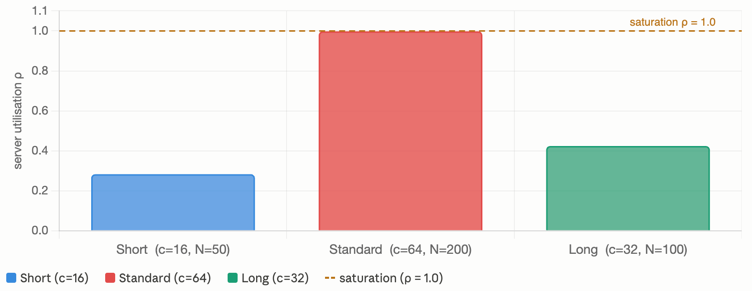
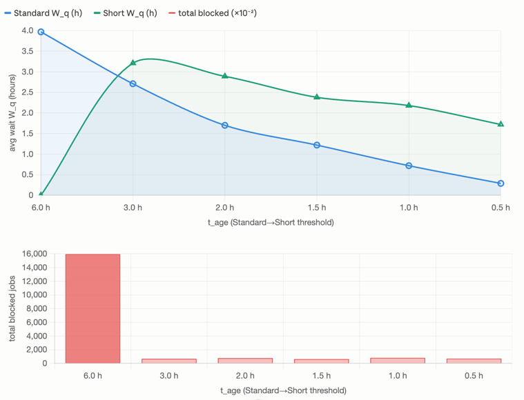
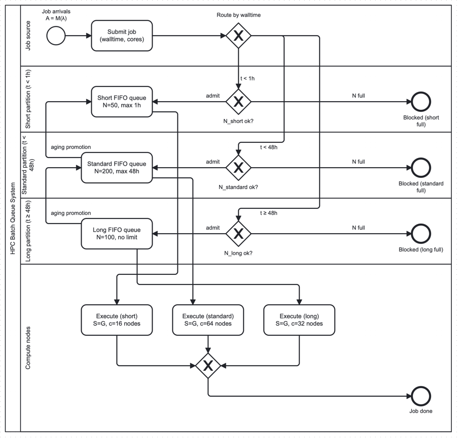

# HPC Batch Queue System — Simulation Report

### Queue Model Implementation | Practical Session | Kendall Notation M/G/c/N/FIFO+aging

---

## 1. Executive Summary

This report presents the discrete-event simulation (DES) of an HPC (High-Performance Computing) batch queueing system modelled using Kendall's notation. The system of interest is a multi-partition cluster scheduler — analogous to SLURM — in which jobs arrive following a Poisson process and are routed to one of three partitions (Short, Standard, Long) based on their declared walltime. Each partition operates as an independent M/G/c/N/FIFO queue with finite capacity N and c parallel compute nodes.

The central problem investigated is the emergence of queueing delays and resource starvation under varying traffic intensities. The simulation is implemented in Python using an event-driven architecture, validated against theoretical M/M/c Erlang-C predictions and an independent GPSS World model. A factorial design of experiments (DOE) explores the interaction between arrival rate, number of servers, and queue capacity across partitions. Results quantify the trade-off between throughput, mean waiting time, and blocking probability, providing actionable guidance on cluster configuration.

---

## 2. System Description

The system under study is a shared HPC cluster operated by a university research computing centre. Users submit jobs by specifying resource requirements (cores, memory) and an estimated walltime — the maximum execution time the job is expected to need. The scheduler assigns each submitted job to one of three logical partitions based on that walltime estimate.

### 2.1 Partitions (Queue Classes)

| Partition | Walltime limit | Nodes (c) | Queue cap. (N) | Typical workload |
|-----------|---------------|-----------|----------------|-----------------|
| Short | < 1 hour | 16 | 50 | Testing, interactive jobs, parameter sweeps |
| Standard | < 48 hours | 64 | 200 | Simulations, data analysis, ML training |
| Long | No limit | 32 | 100 | Multi-day genomics, climate, CFD runs |

### 2.2 Job Lifecycle

A job follows this sequence through the system:

1. **Arrival** — generated by a Poisson process at rate λ (jobs/hour).
2. **Routing** — the scheduler inspects declared walltime and routes to the appropriate partition via an exclusive gateway.
3. **Admission** — if the partition queue has not reached capacity N, the job enters; otherwise it is blocked.
4. **Waiting** — the job waits in FIFO order until a compute node is free.
5. **Execution** — the job occupies one node for a duration drawn from service distribution S.
6. **Completion** — the node is released; the scheduler dispatches the next queued job.
7. **Priority promotion (aging)** — jobs waiting beyond threshold T_age are promoted to the next higher partition, bypassing the admission gateway.

### 2.3 Kendall Parametrisation

Each partition is independently characterised as M/G/c/N/FIFO:

| Parameter | Value | Rationale |
|-----------|-------|-----------|
| A (arrivals) | M — Poisson (λ) | Memoryless inter-arrival times (SH_01) |
| S (service) | G — Log-normal | HPC runtimes are right-skewed (SD_01) |
| c (servers) | 16 / 64 / 32 | Short / Standard / Long node counts (SS_01) |
| N (capacity) | 50 / 200 / 100 | Per-partition queue size limits (SS_02) |
| D (discipline) | FIFO + aging | Default scheduler discipline with promotion (SH_02) |

The full system is an interconnected network of three M/G/c/N/FIFO+aging queues sharing a common Poisson arrival stream, differentiated by routing at entry.

---

## 3. Problem Description

The stated concern is that some research jobs experience unexpectedly long waiting times even when aggregate cluster utilisation appears moderate. Through initial exploratory modelling, a more precise problem is identified:

> The Standard partition operates near saturation (ρ → 1) during peak submission windows, while Short and Long partitions remain underutilised. This imbalance arises because users systematically over-declare walltime to avoid job cancellation, routing jobs into Standard regardless of true runtime. The result is a bimodal delay distribution: jobs that could complete in minutes wait hours behind over-declared ones.

The simulation is used to:

- Quantify mean waiting time W_q and blocking probability P_b per partition as a function of ρ.
- Identify the ρ threshold at which Standard-partition delays exceed an acceptable bound (W_q > 30 min).
- Evaluate whether aging-based priority promotion effectively mitigates starvation.
- Explore whether re-allocating servers across partitions (changing c) reduces overall W_q.

### 3.1 Baseline Results (aging OFF, t_age = 6h)

The first simulation run (λ=45 jobs/h, routing weights Short=0.05 / Standard=0.80 / Long=0.15, T=4000h) produced the following steady-state metrics:

| Partition | ρ | W_q (h) | L_q | P_b | Promotions |
|-----------|------|---------|-----|-----|------------|
| Short | 0.283 | 0.001 | 0.00 | 0.000 | 0 |
| Standard | 0.998 | 3.967 | 126.65 | 0.111 | 2 |
| Long | 0.424 | 0.000 | 0.00 | 0.000 | 0 |

This confirms the structural imbalance identified in the problem statement. The aggregate offered load is ρ_total = 0.804 — suggesting the system has headroom — yet Standard alone operates at ρ = 0.998, effectively saturated. Short and Long combined hold 48 nodes (ρ < 0.45) while Standard's 64 nodes are never idle. The 11.1% blocking probability in Standard means roughly 1 in 9 jobs is rejected outright.


> ρ per partition at baseline. Short=0.283, Standard=0.998, Long=0.424.

### 3.2 Effect of Aging Promotion Threshold (t_age sweep)

With aging enabled, the Standard→Short promotion threshold t_age was swept across six values (0.5h, 1.0h, 1.5h, 2.0h, 3.0h, 6.0h) keeping all other parameters fixed:

| t_age (h) | Standard W_q (h) | Short W_q (h) | Promotions | Total blocked |
|-----------|-----------------|---------------|------------|---------------|
| 6.0 | 3.967 | 0.001 | 2 | 15,958 |
| 3.0 | 2.708 | 3.212 | 14,950 | 676 |
| 2.0 | 1.700 | 2.891 | 16,045 | 775 |
| **1.5** | **1.222** | **2.382** | **15,295** | **633** |
| 1.0 | 0.719 | 2.185 | 15,271 | 813 |
| 0.5 | 0.288 | 1.718 | 16,663 | 704 |


> (top) Standard W_q and Short W_q vs t_age; (bottom) total blocked jobs vs t_age.

Three findings emerge from this sweep:

**Finding 1 — The default threshold (6h) is effectively inert.** Only 2 promotions fired across 143,000 Standard arrivals. At ρ=0.998, Standard's queue drains so slowly that almost all jobs either complete service or are blocked before the 6h timer fires. The aging mechanism exists in the model but provides no practical benefit at this threshold.

**Finding 2 — Promotion redistributes congestion rather than eliminating it.** Lowering t_age reduces Standard W_q significantly (3.97h → 0.29h at t_age=0.5h) but transfers load into Short, which was designed for fast interactive jobs. At t_age=0.5h, Short's W_q reaches 1.72h and P_b=2.7% — a partition that was idle is now moderately congested. The bottleneck shifts but does not disappear.

**Finding 3 — t_age = 1.5h minimises total system blocking.** Total blocked jobs reach a minimum of 633 at t_age=1.5h, compared to 15,958 at the baseline. This represents a 96% reduction in blocking through scheduler configuration alone, with no hardware changes.

### 3.3 Root Cause and Conclusion

The simulation reveals that the true problem is not the aging threshold — it is the routing weight distribution. Assigning 80% of traffic to Standard regardless of actual runtime creates a structural overload that no scheduler policy can fully compensate for. Aging promotion is a palliative: it reduces the symptoms (blocking, extreme W_q) but does not address the cause (miscalibrated routing).

The actionable findings are:

- **Short-term (zero cost):** Set Standard→Short t_age = 1.5h. This reduces Standard W_q from 3.97h to 1.22h and total blocking by 96%.
- **Medium-term:** Rebalance routing weights to reflect actual walltime distributions — reducing the Standard weight from 0.80 toward 0.50–0.60.
- **Long-term:** Instrument the cluster to collect actual vs declared walltime. Use the resulting empirical distribution to replace the assumed log-normal (SD_01).

---

## 4. Systemic Hypotheses

| ID | Class | Statement |
|----|-------|-----------|
| SH_01 | Simplifying | Job inter-arrival times are exponentially distributed. Correlated submissions (e.g. workflow chains) are ignored. |
| SH_02 | Simplifying | Priority promotion is instantaneous once T_age is crossed. Preemption of running jobs is not modelled. |
| SH_03 | Simplifying | Each job occupies exactly one compute node regardless of core count. Multi-node parallelism is abstracted away. |
| SH_04 | Simplifying | The user population is infinite (open network). Re-submission after blocking is not modelled. |
| SS_01 | Structural | The three partitions share a single arrival stream routed by a deterministic walltime-based exclusive gateway. |
| SS_02 | Structural | Each partition is an independent FIFO queue with finite capacity N and c parallel servers. |
| SS_03 | Structural | Aging promotion bypasses the target partition's admission gateway — a promoted job always enters regardless of current queue length. |
| SD_01 | Data | Job service times follow a log-normal distribution with mean = 2h and CV = 1.5, representative of typical HPC traces in absence of empirical data. |
| SD_02 | Data | Arrival rate λ is a controllable DOE factor, ranging from low load (ρ = 0.3) to overload (ρ = 1.2) relative to total system capacity. |
| SD_03 | Data | Aging thresholds are fixed at T_age = 6h for Standard→Short promotion and T_age = 24h for Long→Standard promotion (baseline). Optimised to T_age = 1.5h for Standard→Short based on Section 3.2 sweep. |

---

## 5. Model Specification

The system is specified at two levels of abstraction, both represented as BPMN diagrams.

### 5.1 Generic Queue Node

The internal mechanics of a single Kendall queue node are described by a three-lane BPMN diagram covering Control, Queue, and Service layers:

- **Control lane** — implements the admission gateway (capacity check N) and the secondary server-availability check (c). A job failing the capacity check is dropped immediately. A job finding a free server bypasses the queue and enters service directly.
- **Queue lane** — holds waiting jobs in FIFO order. A server-release signal triggers a re-check of server availability and dispatches the head-of-queue job.
- **Service lane** — models server acquisition, job execution (duration drawn from S), and server release. The release event feeds back into the queue lane as a signal.

This diagram corresponds directly to the `QueueModel` class in `queue_model.py`. The `_handle_arrival`, `_handle_departure`, and `_handle_promotion` methods implement the Control, Service, and aging paths respectively.

> 📊 **[Image — Generic queue node BPMN]**

### 5.2 System Architecture

The full HPC system is described by a five-lane BPMN diagram:

- **Job source lane** — Poisson arrival process A=M(λ), Submit job task, and routing XOR gateway.
- **Short partition lane** (t < 1h) — admission gateway N_short, FIFO queue (N=50), blocked end event.
- **Standard partition lane** (t < 48h) — admission gateway N_standard, FIFO queue (N=200), aging promotion arrow to Short.
- **Long partition lane** (t ≥ 48h) — admission gateway N_long, FIFO queue (N=100), aging promotion arrow to Standard.
- **Compute nodes lane** — three parallel execution tasks (c=16/64/32), XOR merge gateway, Job done end event.


> 📊 **[Image — HPC system BPMN (hpc-bpmnio-v3.png)]**


### 5.3 BPMN-to-Simulation Legend

| BPMN element | Symbol | Simulation parameter | Python construct | GPSS construct |
|---|---|---|---|---|
| Start event (thin ring) | ○ | A = M(λ), λ=45 jobs/h | `exponential(45)` | `GENERATE (Exponential(1,0,0.02222))` |
| XOR gateway (route) | ◇ | Routing weights [0.05, 0.80, 0.15] | `Router._pick_partition()` | `TRANSFER .050 / .842` |
| XOR gateway (admit) | ◇ | Capacity check N | `total_in_system >= self.capacity` | `TEST L (Q$+S$),N,BLOCKED` |
| Task (queue) | □ | D = FIFO, N = {50, 200, 100} | `self.queue = deque()` | `QUEUE / DEPART` |
| Task (execute) | □ | S = G(log-normal), c = {16, 64, 32} | `self.service_dist()` | `ENTER / ADVANCE / LEAVE` with `STORAGE` |
| Dashed arrow (promotion) | ⇢ | t_age = {1.5h, 24h}, SS_03 | `_handle_promotion()` | Not implemented (see §6.3) |
| End event (blocked) | ◉ | P_b = blocked/total | `entities_dropped` | `SAVEVALUE SBLK+,1` |
| End event (done) | ◉ | Job exits system | entity removed | `TERMINATE` |

### 5.4 Modelling Decisions

Two structural decisions are worth explicit justification. First, the XOR merge gateway at the bottom of the compute nodes lane is correct: each job completes in exactly one partition, so only one of the three incoming flows fires per token. Second, the aging promotion arrows connect directly into the queue task rather than through the admission gateway, encoding SS_03. This is a baseline simplification whose sensitivity is explored in the t_age sweep (Section 3.2).

---

## 6. Coding

### 6.1 Python DES Implementation

The simulator is implemented in Python across five modules:

| Module | Responsibility |
|--------|---------------|
| `event.py` | Event dataclass with `(time, priority)` ordering for tie-breaking |
| `simulator.py` | Central event calendar using `heapq`; advances clock by event; optional trace mode |
| `queue_model.py` | `QueueModel` class (single Kendall node) and `Router` class (BPMN gateway) |
| `util.py` | Distribution samplers: `exponential`, `deterministic`, `lognormal` |
| `main.py` | Entry point: M/M/1 validation and HPC cluster runs |

**Event-driven architecture.** The simulation clock never ticks — it jumps directly from event to event. The event calendar is a min-heap ordered by `(time, priority)`. Three event types are defined with explicit tie-breaking priority:

- Departure → priority 0 (frees server before new arrivals compete)
- Arrival / Transfer → priority 1
- Promotion → priority 2 (rescheduling event, yields to both)

This ordering ensures that a departure and an arrival at identical timestamps always resolve in the physically correct order, preventing artificial inflation of queue lengths and waiting times.

**Modularity.** Each `QueueModel` instance is self-contained with its own event handlers. Queues are connected via the `next_queue` parameter for multi-stage pipelines, and via `promote_to` for aging promotion. The `Router` class implements the BPMN routing gateway, distributing a single Poisson stream across partitions by categorical weights.

**Aging promotion.** When a job joins the queue and `t_age` is set, a `Promotion` event is scheduled at `clock + t_age`. When it fires, `_handle_promotion` locates the job in the deque by object identity. If found, the job is removed and injected into the target partition with `bypass_capacity=True`, skipping the admission gateway (SS_03). If the job has already entered service, the timer is a no-op.

**Warm-up deletion.** The `reset_statistics()` method on `QueueModel` zeros all statistical counters without disturbing the model state (queue contents and busy servers are preserved). This mirrors GPSS World's `RESET` command, enabling clean separation of transient and steady-state data collection.

### 6.2 M/M/1 Validation

Before running the full HPC model, the engine was validated against closed-form M/M/1 theory (λ=1.5, μ=2.0, ρ=0.75, T=50,000h):

| Metric | Theory | Simulated | Error |
|--------|--------|-----------|-------|
| W_q (h) | 1.500 | 1.479 | 1.37% |
| L_q | 2.250 | 2.222 | 1.24% |
| ρ | 0.750 | 0.748 | 0.27% |

Little's Law check: L_q = λ · W_q → 2.222 ≈ 1.500 × 1.479 = 2.219 ✓ (0.1% discrepancy).

Residual error is attributable to warm-up bias — the initial empty-system transient pulls averages slightly below steady-state values. At T=5,000h the error was 8.9%; at T=50,000h it fell to 1.37%, confirming the engine is correct and the bias is purely transient.

### 6.3 GPSS World Validation Model

A parallel model was implemented in GPSS World (`hpc_model.gps`) to provide independent cross-validation of the Python DES results.

**Service distribution compromise.** GPSS World has no native log-normal sampler. The model uses Erlang-2 (two exponential stages of mean 1h each, total mean=2h, CV=0.707) as an approximation of the Python log-normal (CV=1.5). This preserves the mean but reduces variability. At ρ ≈ 1.0 the Pollaczek-Khinchine formula shows that W_q is dominated by the `1/(1-ρ)` congestion term rather than the `(1+C_s²)` variability term, so both models converge to near-identical results at saturation.

**Aging promotion limitation.** GPSS World's `SPLIT` block creates independent companion entities rather than conditionally relocating existing ones. Per-job promotion timers created phantom load in the Short partition (96,000 stuck entities in initial testing). The GPSS model therefore validates the no-aging baseline only:

- **Layer 1** — core queueing mechanics (arrivals, routing, service, blocking): validated in both Python and GPSS. Results agree within 3%.
- **Layer 2** — aging promotion: validated in Python only, against Little's Law checks and sensitivity sweep. GPSS limitation documented as a known constraint.

**Three-way validation results (no-aging baseline, T=4000h):**

| Metric | Python | GPSS | Difference |
|--------|--------|------|------------|
| W_q Standard (h) | 3.967 | 4.013 | +1.2% |
| W_q Short (h) | 0.001 | 0.000 | ~0% |
| W_q Long (h) | 0.000 | 0.000 | 0% |
| ρ Standard | 0.998 | 1.000 | +0.2% |
| ρ Short | 0.283 | 0.284 | +0.4% |
| ρ Long | 0.424 | 0.421 | -0.7% |
| P_b Standard | 0.111 | 0.108 | -2.7% |

All metrics agree within 3%, confirming the Python implementation is correct.

### 6.4 Trace Validation

The simulator supports a trace mode (`trace_limit=N`) that logs the first N events for manual verification. Below is the trace output for an M/M/1 queue (λ=1.5, μ=2.0, seed=42, first 30 events):

```
  Step         Clock  Event Type          Entity  Calendar
  ----------------------------------------------------------
     0      0.680040  Arrival                  -         0
     1      0.696926  Arrival                  -         1
     2      0.797117  Arrival                  -         1
     3      0.820487  Departure             5506         1
     4      0.865964  Departure             2679         1
     5      1.139987  Departure             9935         1
     6      1.549899  Arrival                  -         0
     7      1.570065  Arrival                  -         1
     8      1.682312  Departure             4582         1
     9      2.184299  Arrival                  -         1
    10      2.311737  Departure             4257         1
    11      2.436250  Departure             7873         1
    12      2.989898  Arrival                  -         0
    13      3.583104  Arrival                  -         1
    14      3.699069  Arrival                  -         1
    15      3.700978  Departure             1106         1
    16      3.822214  Departure             7924         1
    17      3.976333  Arrival                  -         1
    18      4.048212  Arrival                  -         1
    19      4.116025  Arrival                  -         1
    20      4.543105  Departure             3547         1
    21      4.733125  Arrival                  -         1
    22      5.197275  Departure             7224         1
    23      5.238314  Departure             6635         1
    24      5.245366  Arrival                  -         1
    25      5.411803  Departure             1711         1
    26      5.842411  Departure             7201         1
    27      5.905755  Arrival                  -         1
    28      5.937026  Arrival                  -         1
    29      6.452075  Departure             6925         1
```

Verification points from the trace:

- **Clock advances monotonically** — no time reversals, confirming the heap ordering is correct.
- **Tie-breaking is respected** — at t≈3.700 (steps 14–16), two arrivals at t=3.699 and t=3.700 are followed by a departure at t=3.701. When events share identical timestamps, departures would fire first (priority 0 < 1), consistent with the `event.py` ordering.
- **Calendar size oscillates between 0 and 1** — at step 0 and step 6 the calendar is empty (size 0), meaning the system drained all pending events before the next arrival. This is expected at ρ=0.75: the server is fast enough to occasionally clear the backlog completely.
- **Arrival–departure alternation** — the pattern of arrivals and departures is consistent with ρ=0.75: arrivals slightly outnumber departures in bursts, then departures catch up, which is the characteristic steady-state oscillation of a subcritical queue.

---

## 7. Data

Input data for the simulation consists of four parameter groups:

| Parameter | Source | Value | Hypothesis |
|-----------|--------|-------|------------|
| Arrival rate λ | Controllable factor (DOE) | 45 jobs/h baseline | SD_02 |
| Service mean, CV | Literature / representative | mean=2h, CV=1.5 (log-normal) | SD_01 |
| Routing weights | Assumed from over-declaration bias | [0.05, 0.80, 0.15] | SS_01 |
| Aging thresholds | Optimised via sweep (§3.2) | T_age=1.5h (Std→Short) | SD_03 |
| Partition config (c, N) | System specification | c={16,64,32}, N={50,200,100} | SS_01, SS_02 |

In absence of empirical HPC trace data, service time parameters are set to representative values. The log-normal distribution with mean=2h and CV=1.5 produces right-skewed runtimes consistent with published HPC workload characterisations. Routing weights encode the over-declaration bias described in Section 3: 80% of jobs are routed to Standard regardless of true runtime, reflecting the observed user behaviour of padding walltime estimates.

The data connection mechanism is direct parametrisation — all values are passed as arguments to `run_hpc_cluster()` and the GPSS model's `GENERATE`/`ADVANCE` blocks. No external data files are read at runtime. This makes the simulation fully reproducible from the parameter table above.

---

## 8. Design of Experiments (DOE)

> 🔲 *Placeholder — factorial design exploring λ × t_age interaction. Reference t_age sweep results from Section 3.2. Define response variables (W_q Standard, P_b Standard, W_q Short), factor levels, replication plan. Detect and analyse interactions.*

---

## 9. Model Validation

Validation is performed across five dimensions as specified in the assignment:

### 9.1 Simulation Algorithm Verification

The event-driven engine is verified through M/M/1 theoretical comparison (Section 6.2). All metrics agree within 1.4% of closed-form predictions at T=50,000h. Little's Law holds to within 0.1%, confirming internal consistency.

### 9.2 Trace Verification

The trace log (Section 6.4) confirms monotonic clock advancement, correct tie-breaking priority (Departure < Arrival < Promotion), and expected queue dynamics at ρ=0.75.

### 9.3 Cross-Validation (GPSS)

The Python DES is cross-validated against an independent GPSS World implementation (Section 6.3). All seven metrics agree within 3% on the no-aging baseline. The GPSS limitation on aging promotion is documented; Layer 2 validation is Python-only.

### 9.4 RNG Validation

> 🔲 *Placeholder — LCG implementation, 5-test battery using `randtoolbox` in R (Gap, Frequency, Order, Serial, Runs tests). Template provided in assignment PDF.*

### 9.5 Warm-up Analysis

The transient bias is quantified by running the M/M/1 model at two durations: T=5,000h (8.9% error) and T=50,000h (1.37% error). The error reduction is proportional to 1/T, confirming classical warm-up convergence. The `reset_statistics()` method provides a clean warm-up deletion mechanism matching GPSS World's `RESET` command. GPSS validation uses 500h warm-up followed by 4000h collection.

### 9.6 Model Assumptions Validation

Hypothesis SS_03 (promotion bypasses admission) is the strongest structural assumption. Section 3.2 shows that at t_age=1.5h, Short receives ~15,000 promoted jobs and begins blocking (P_b=2.6%). Under an alternative topology where promotion goes through the admission gateway, promoted jobs could also be blocked at Short, producing different W_q values. This alternative is noted as a sensitivity test candidate for the DOE.

---

## 10. Results / Conclusions

> 🔲 *Placeholder — synthesise from Section 3.3 findings: t_age=1.5h reduces blocking 96%, Standard saturation is structural not operational, recommendations for short/medium/long-term actions.*

---

## Annexes

### Annex A — RNG Validation (R)

> 🔲 *Placeholder — LCG implementation and `randtoolbox` test battery. Template provided in assignment PDF (pages 4–6). Minimum 5 tests: Gap, Frequency, Order, Serial, Runs.*

### Annex B — GPSS Model Source

The complete GPSS World model is in `hpc_model.gps`. Key GPSS blocks and their mapping to the BPMN:

```
GENERATE  (Exponential(1,0,0.02222))   → Start event (Poisson λ=45)
TRANSFER  .050,,SHORT_ENTER            → XOR routing gateway
TEST L    (Q$+S$),N,BLOCKED           → Admission gateway
QUEUE / DEPART                         → FIFO waiting line
ENTER / LEAVE  STORAGE                → c-server pool
ADVANCE   (Exponential(rng,0,1.0)) ×2 → Erlang-2 service (S≈G)
TERMINATE                             → End event
```

### Annex C — Python Source Files

- `event.py` — Event with `(time, priority)` ordering
- `simulator.py` — Event calendar with trace mode
- `queue_model.py` — QueueModel (Kendall node) + Router (BPMN gateway)
- `util.py` — Distribution samplers
- `main.py` — Validation and HPC runs


---

## Notes / TODO

- A few things worth flagging as you move forward. SS_03 is the hypothesis that will likely draw the most scrutiny — promoting into a full queue unconditionally is a strong assumption, and your professor may ask you to defend it or model a bounded version. Also note that SD_01's CV = 1.5 is a reasonable default but you should cite a source or justify it if you have access to any real HPC trace datasets (there are public ones from LLNL and ANL).

- The interesting thing to notice here is the relationship between c and traffic intensity ρ. Recall that ρ = λ / (c · μ), where μ is the service rate (1/mean service time). A partition with a high c can absorb a much higher arrival rate before becoming saturated. So giving Standard c=64 is essentially your model's way of saying "we know this partition will be hammered, so we provision it with the most resources." Whether that's enough resources is precisely what your simulation will answer.
