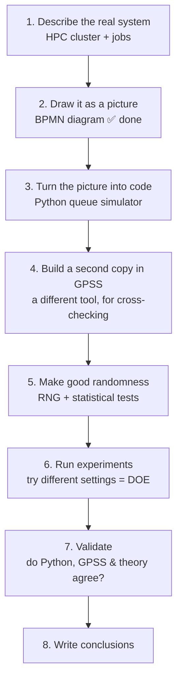

Here's the big picture, explained simply.

## Why this exists (the "why")

Imagine a **supermarket with a few checkout lines**. Customers show up, wait, get served, leave. Now imagine you run the supermarket and someone asks: *"If we get busier on weekends, will lines get too long? Should we add a checkout?"*

You **can't** just test it on real customers — too slow, too risky, too expensive. So instead you build a **toy version on the computer** that behaves like the real thing, and you experiment on the toy. That's a **simulation**.

In this project the "supermarket" is an **HPC cluster** (a big shared supercomputer). Instead of shoppers, **computing jobs** arrive, wait in line for compute nodes, run, and finish. You want to answer questions like: *how long do jobs wait? are the machines well-used? what happens when it gets crowded?*

## The vocabulary you keep seeing

- **Queue** = a waiting line.
- **Kendall's notation `A/S/c/N/D`** = a 5-part "recipe card" that fully describes one line:
  - `A` how often customers arrive, `S` how long service takes, `c` how many servers, `N` max line length, `D` the rule for who's served next (first-come-first-served, etc.).
- **Event-driven** = the clock only jumps to "interesting moments" (someone arrives, someone finishes), instead of ticking every second. Much faster.

## The logical steps (the "what", in order)

1. **Describe the system** — what are jobs, queues, servers? (the system description section)
2. **Draw the BPMN** ✅ — the picture you just finished. It's the *blueprint* everyone agrees on before coding. Lanes = lines, start event = arrivals, tasks = work, gateway = the priority/standard decision.
3. **Code it** — the Python files (queue_model.py, simulator.py) make the blueprint actually *run* and produce numbers.
4. **Build a GPSS copy** — re-build the same model in a second, specialized tool. If two independent builds give the same answer, you trust the answer.
5. **Randomness (RNG)** — arrivals/service times are random. You need a random-number generator that's *actually* random, proven by passing standard statistical tests (the R `randtoolbox` part).
6. **Experiments (DOE = Design of Experiments)** — systematically try different settings (more servers? higher arrival rate?) to find the *best* configuration.
7. **Validate** — check the simulator is correct: does it match math theory and the GPSS version?
8. **Conclusions** — answer the original question.

## The end result (the "so what")

A short report that says something like:

> *"We modeled the cluster as priority + standard queues. Our Python simulator agrees with both queueing theory and an independent GPSS model. Experiments show that with arrival rate X, you need at least `c = N` servers to keep average wait under Y, otherwise jobs start getting dropped. Recommendation: …"*

Plus the **artifacts** that back it up: the BPMN blueprint (done), the working Python simulator, the GPSS validation model, the tested RNG, and the experiment results.

## Where you are right now

✅ Step 2 (BPMN blueprint + legend) — done.
➡️ Next natural step is **3**: make sure the Python simulator faithfully implements that blueprint (right now main.py only runs a single basic `M/M/1` queue — it doesn't yet have the priority/standard split, capacity, or statistics like waiting time and utilization that the report needs).

Want me to walk through the existing Python code and line it up with the BPMN, so the simulator actually matches the picture?